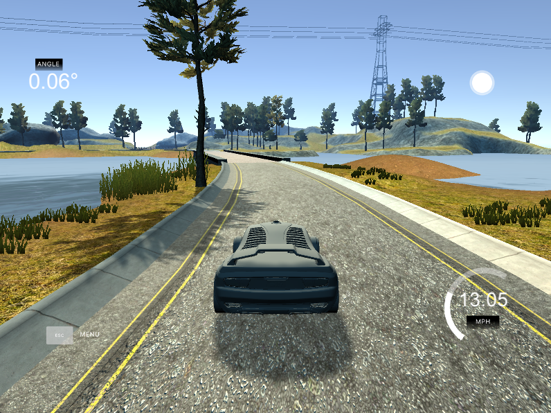
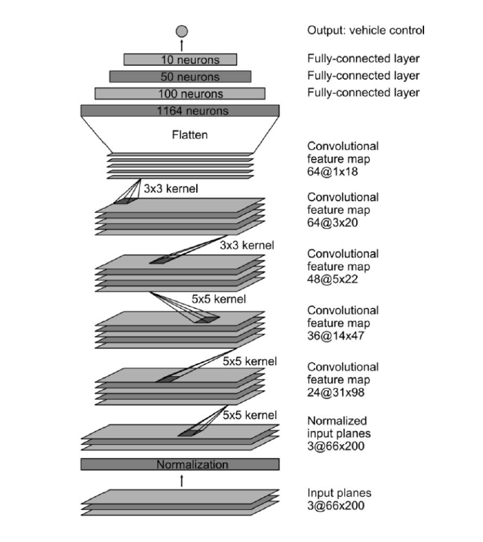

# Self-Driving Car Simulation Project

A deep learning project that trains a Convolutional Neural Network (CNN) to autonomously drive a car in the Udacity self-driving car simulator using end-to-end learning.

## 🎯 Project Overview

This project implements an autonomous driving system using the NVIDIA CNN architecture. The model learns to predict steering angles from camera images, enabling the car to navigate the track without human intervention.

<div align="center">

</div>

### Key Features

- End-to-end learning from raw pixels to steering commands
- NVIDIA-inspired CNN architecture with 5 convolutional and 4 fully connected layers
- Data augmentation techniques (flipping, brightness adjustment, panning, zooming, shadows)
- Real-time autonomous driving in simulator
- Comprehensive data visualization and analysis tools

## 🏗️ Architecture

The model uses the NVIDIA self-driving car architecture:

- **Input**: 66×200×3 YUV images
- **5 Convolutional layers**: Feature extraction from road images
- **4 Fully connected layers**: Steering angle prediction
- **Output**: Single steering angle value (-1 to 1)

Total parameters: ~1.6 million

<div align="center">

</div>

## 📁 Project Structure

```
SELF_DRIVING_CAR/
├── data/
│   ├── IMG/                          # Training images
│   └── driving_log.csv               # Steering angles and metadata
├── augmentation_examples.png         # Data augmentation visualization
├── batch_generator.py                # Batch data loading with augmentation
├── data_augmentation.py              # Image augmentation functions
├── drive.py                          # Autonomous mode driver script
├── model.keras                       # Trained model (generated)
├── package_list.txt                  # Python dependencies
├── preprocess_images.py              # Image preprocessing pipeline
├── preprocessing_steps.png           # Preprocessing visualization
├── sample_batch.png                  # Sample training batch
├── steering_histogram.png            # Steering angle distribution
├── train_model.py                    # Model training script
├── training_history.png              # Training metrics plot
└── visualize_steering_data.py        # Data analysis tool
```

## 🚀 Getting Started

### Prerequisites

- Python 3.11+
- TensorFlow 2.19+
- CUDA-compatible GPU (optional, for faster training)
- Udacity Self-Driving Car Simulator

### Installation

1. **Clone the repository**

```bash
git clone <repository-url>
cd SELF_DRIVING_CAR
```

2. **Create virtual environment**

```bash
python -m venv venv
source venv/bin/activate  # On Windows: venv\Scripts\activate
```

3. **Install dependencies**

```bash
pip install -r package_list.txt
```

4. **Download the simulator**

- Download from [Udacity Self-Driving Car Simulator](https://github.com/udacity/self-driving-car-sim)
- Extract and run `beta_simulator.exe`

## 📊 Data Collection

1. **Launch simulator** → Select **"Training Mode"**
2. **Click "Record"** button and choose save location
3. **Drive manually** using keyboard/mouse:
   - Arrow keys or mouse for steering
   - Drive 5-10 laps forward
   - Drive 5-10 laps backward
4. **Stop recording** when finished

**Tips for better data:**

- Use mouse for smooth steering
- Drive at consistent speed
- Cover entire track multiple times
- Include recovery maneuvers from edges

## 🔍 Data Analysis

### Visualize steering angle distribution

```bash
python visualize_steering_data.py
```

Generates `steering_histogram.png` showing data balance.

### View preprocessing steps

```bash
python preprocess_images.py
```

Generates `preprocessing_steps.png` showing image transformations.

### View augmentation examples

```bash
python data_augmentation.py
```

Generates `augmentation_examples.png` showing augmentation techniques.

## 🎓 Training the Model

### Basic training

```bash
python train_model.py
```

### Configuration

Edit `train_model.py` to modify hyperparameters:

```python
CONFIG = {
    'csv_path': '../data/driving_log.csv',
    'balance': True,           # Balance straight vs turning data
    'batch_size': 32,          # Samples per batch
    'epochs': 50,              # Maximum training epochs
    'learning_rate': 0.0003,   # Adam optimizer learning rate
    'model_save_path': 'model.keras'
}
```

### Training process

1. Loads and balances dataset (removes excess straight driving)
2. Splits into 80% training, 20% validation
3. Applies augmentation to training data only
4. Trains with early stopping (patience=5)
5. Saves best model based on validation loss
6. Generates `training_history.png`

**Expected results:**

- Training time: 5-15 minutes (CPU) or 2-5 minutes (GPU)
- Validation loss: 0.03-0.05
- Validation MAE: 0.13-0.15

## 🚗 Running Autonomous Mode

### Start the driver

```bash
python drive.py model.keras
```

Optional: Set custom max speed

```bash
python drive.py model.keras 10  # Max speed 10 MPH
```

### Launch simulator

1. Open simulator
2. Select **"Autonomous Mode"**
3. Choose the track you trained on
4. Watch the car drive itself!

### Monitor performance

The terminal displays real-time telemetry:

```
Speed:  13.2 MPH | Steering: -0.0612 | Throttle: 0.12
```

## 🛠️ Preprocessing Pipeline

1. **Crop**: Remove sky (top) and hood (bottom) → 75×320 region
2. **Color space**: Convert BGR to YUV
3. **Blur**: Apply Gaussian blur (3×3 kernel)
4. **Resize**: Scale to 66×200 (NVIDIA standard)
5. **Normalize**: Scale pixels to [0, 1]

## 🎨 Data Augmentation

Applied randomly during training:

- **Horizontal flip** (50%): Mirrors image and negates steering
- **Brightness** (50%): Simulates lighting conditions
- **Shadow** (30%): Adds random shadows
- **Pan** (30%): Horizontal shift ±50 pixels
- **Zoom** (30%): Scale ±20%

## 📈 Model Performance

### Metrics

- **Loss**: Mean Squared Error (MSE)
- **MAE**: Mean Absolute Error (degrees)

### Training results

```
Validation Loss (MSE): 0.0323
Validation MAE: 0.1392
Training samples: 4,312
Validation samples: 1,078
```

## 🐛 Troubleshooting

### Car goes off track

- Collect more diverse training data
- Add recovery data (steering from edges)
- Lower max speed in `drive.py`
- Retrain with more epochs

### Model not improving

- Check data balance (should have ~40-50% turns)
- Increase data collection (aim for 15,000+ images)
- Verify preprocessing matches training

### Connection issues

- Ensure correct socketio versions:
  ```bash
  pip install python-socketio==4.2.1 python-engineio==3.8.2
  ```
- Check firewall settings for port 4567

## 📦 Key Dependencies

- TensorFlow 2.19+
- Keras 3.11+
- OpenCV 4.12+
- NumPy 2.1+
- Pandas 2.3+
- scikit-learn 1.7+
- Matplotlib 3.10+
- python-socketio 4.2.1
- Flask 3.1+
- Pillow 11.3+

## 🎯 Project Goals Achieved

✅ Data collection from simulator  
✅ Data preprocessing and augmentation  
✅ NVIDIA CNN architecture implementation  
✅ Model training with validation  
✅ Real-time autonomous driving  
✅ Performance visualization  
✅ Comprehensive documentation

## 📄 License

Educational project - all rights reserved.

## 🙏 Acknowledgments

- Udacity for the self-driving car simulator
- NVIDIA for the CNN architecture

---

**Happy Autonomous Driving! 🚗💨**
